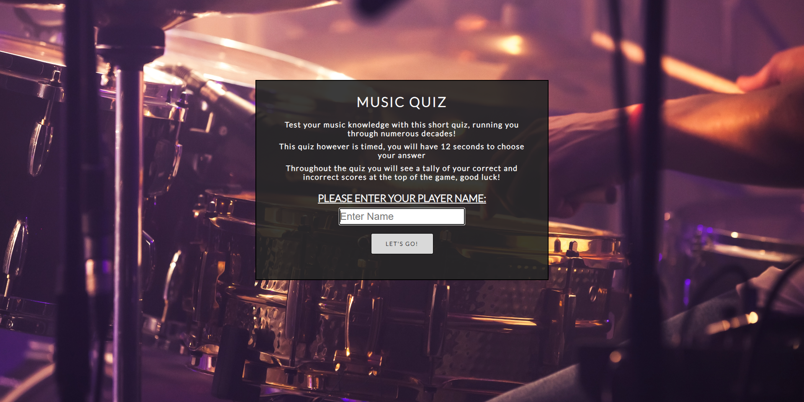
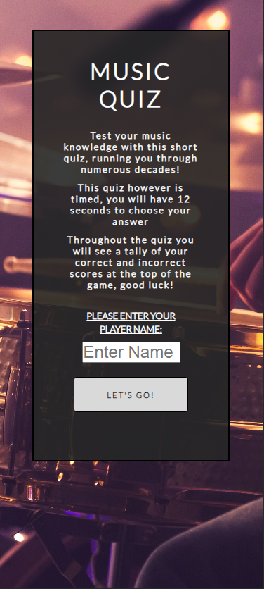
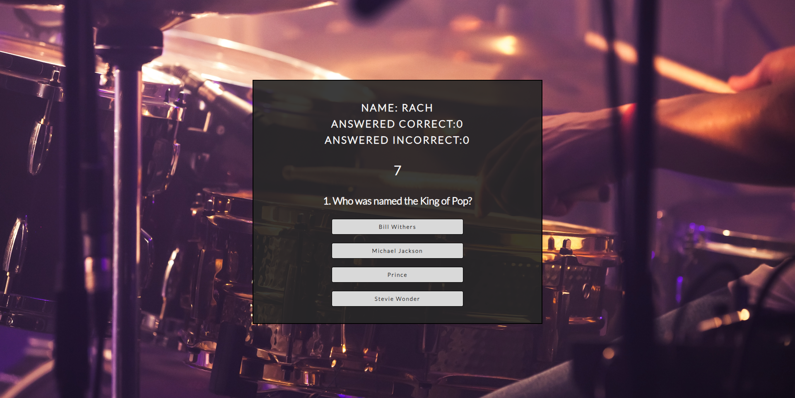
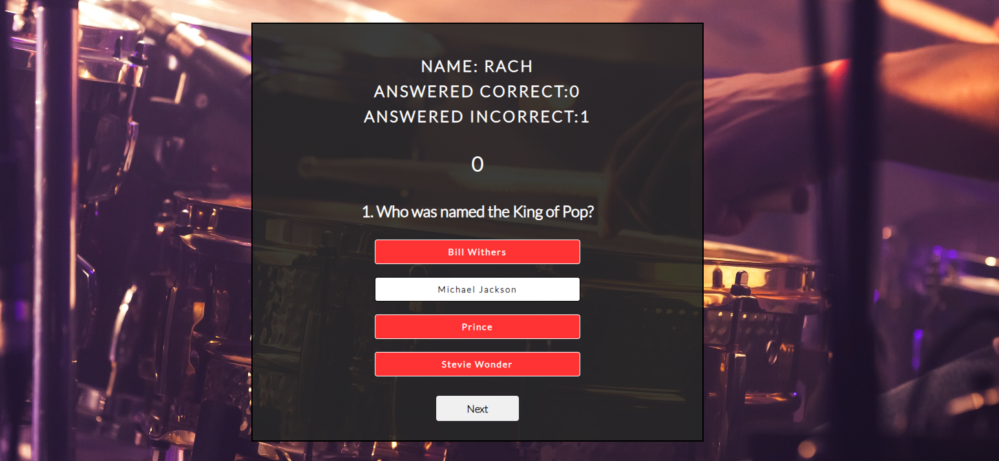

# Music Quiz

This short quiz consists of 9 questions based around multiple eras and stages in music history. This quiz is aimed at people wishing to test their musical knowledge or people looking to expand on some musical knowledge.

[Visit the live project here](https://rachaelbull.github.io/quiz-game/)

AM I RESPONSIVE PHOTO WILL BE HERE

## **User and Creator Stories**

**User Goals**

- As a user, I would want to be able to easily understand what this quiz is for/about
- As a user, I would want the game to be attractive and well styled
- As a user, I would want to easily be able to navigate my way around this quiz
- As a user, I would want to feel a more personalized experience whilst taking part in the quiz, such as an entered name being addressed throughout the game
- As a user, I would expect a quiz to track my progress throughout the game, acknowledging which questions the score reflects upon
- As a user, I would like to feel challenged but not too pressured. For example, having a timer but not a timer that would be so short it would deter me from playing again
- As a user, I would like to have the option to restart the game, without having to enter my details again

**Creator Goals**

- As a creator, I want to provide a warm and attractive landing page to entice the user the stay on the page
- As a creator, I want to ensure the instructions and landing information section is clear and concise to the user
- As a creator, I want to make sure that my content is relevant and interesting
- As a creator, I want my interactive features such as score keeping and the countdown to be clearly stated and easily navigated
- As a creator, I want the user to easily be able to play again
- As a creator, I want the user to feel as though the game is personalized to them such as using the entered name throughout the game and keeping personal scores

As this is aimed to be a small bit of fun for users, I would hope that users who have completed the game and enjoyed it would be likely inclined to come back. I plan to achieve this by making the contents of my live project relevant and interesting.
Also that every element and aspect of the page carefully complement each other by being easily accessible, easy to read and features very easy to navigate.

**Returning visitor expectations**

- As a returning visitor, I would expect my visit to be as enjoyable as the last, if not more.
- As a returning visitor, I would expect my visit to contain relevant content related to the game title and description
- As a returning visitor after a longer period of time, I would expect updated content and structure to the live project, for example, more questions or different questions containing the same relevance, making it more exciting for a past user to return.

## **Scope Plane** ##

In order to achieve these goals both from a user and creator perspective, I intent to include the following features:

- A landing page start area, featuring an attractive and easy on the eye background image
- A rules and information section within the landing start page, containing brief but understandable text to prepare the user to play the quiz
- An input field where the user can enter a personalized name which will be carried throughout the rest of the game
- A submit style button which will display a new section to the user in the event of a click
- A quiz section featuring the personalized name located at the top
- A scorekeeping area located just under the users personalized name
- A 12 second countdown timer located underneath the score keeping area
- A question is featured underneath the timer
- 4 answer selection choices located under the question
- A pop up alert message once an answer is clicked, displaying a short message containing whether the answer was correct or not
- A Next button located underneath the answer selections, taking the user to a new question upon the event of a click
- Upon all questions being answered, a conclusion section will be displayed offering the user to play again in the form of a button, taking the user back to the start of the quiz once clicked

## **Structure Plane** ##

Since this project was first introduced I knew that I wanted to build a project game upon my own ideas. This for me, drove me to work at a fuller potention as I picked a topic that I am very passionate about, that being music. I aim for this project to be interesting
and eyecatching, I will achieve this by keeping the questions hard but not too hard. Hard enough that the user will have to take a few seconds to think about the answer but not too hard that the user will become uninterested and leave the game before it is completed.
I decided that the best way to keep my project game consistant and attractive was to feature a nice background picture which gets carried along to every section and event within the game. I styled the sections boxes and borders in accordance to the background image
colours - opting for darker more transparent backgrounds with white text to make it attravtive and easily readable for the user.

The colors my project consists of are:

- Light Grey - to replace the background colour if the background was to fail to load up
- Black - colour of the section and button borders
- White - used for some text colours throughout the project
- Dark Grey - used with a transparency effect as the background colour for the section areas
- Off White - used as the background colour for most of the buttons across the project
- Red - used as some button background colours to display incorrect answers

## **Skeleton Plane** ##

WIREFRAMES WILL GO HERE

Above is the initial wireframe draft of the game. Please note that the finished project website may differ slightly from this.

As well as creating the wireframes to help guide me, I also used a hand drawing version on pen and paper, this made it easier for smaller changes I would think about and quickly gain a visual through drafting them down on paper.

DIFFERENCES IN WIREFRAMES SECTION WILL GO HERE

//////
/////
//////
//////

## **Surface Plane** ##

**Features that are presented across the project:**

*The Landing/Information Area*

- The landing and information area/page is the first thing the user will be presented with when loading up the page.
- The features on this may sit just ontop of the background image, the scenery and colouring of this picture was carefully selected to create a sense of warmth and comfortability to the page upon the user first entering.

- Above is the landing and information page adjusted to mobile view. Which tries to keep all elements in place just sligntly adjusted more in length and size to fit the screen sizing through media querys.

- Above is the header that is also displayed upon the user first entering the website. The font used here was 'Lato' taken from Google Fonts. I chosen to use this font as it has a much softer look to it than some other fonts. And as stated earlier, I was aiming for
the game to have a softer more comfortable feel to it. The heading text content is very clear and self explanatory as to what subject the quiz is based upon and what is to be expected within the content of the rest of the game. The heading coloring is set to white
as mostly everything surrounding the heading is coloured quite dark - this makes it more visable and enables the header to stand out better, making it much more easily readble to the user and therefore creating a better user experience. An uppsercase text transform
has been applied the heading to seperate the heading from the rest of the text contents without having to change any coloring or font styles - keeping the more simple and softer look.

- The landing page also contains a small information/rules area before any inputs and submittions are made. The text within this small area is factual, brief but very easily understandable. This area explains to the user how they are expected to play the game and
informs the user on what features they should expect if they are to progress past this page.

- Underneath the game rules and information area, the user will be very clearly presented with an input field with a label guiding the user to enter a username which will be carried through to the rest of the game. To make the input a field more understandable
there is some placeholder text within the input field to prompt the user to fill in their name before progressing onto the submit button which will be presented underneath the input field. Above the input field there is an underlined statement asking the user to enter their chosen name. This text is white to flow nicely with the rest of the page styles and to keep the page looking clean, pristine and tidy. An uppercase text transform has been applied to this with an underlining styling to highlight the importance of this feild being completed without the need to change any fonts or colouring of the text to create the same desired effect.

- Placed closely underneath the input field is the submit button which will take the user to the start of the quiz upon the event of a click and the field being filled out correctly. The styling of this button is also soft, still using the same font as the rest of the page to keep that soft, simple and clean look throughout the page. However, the background colour has been ever so slighly changed to an off white/ light grey color and the text set darker to black. This was the give the user something a little different to look at to stand the button out from the rest of the contents without having to add any new dramatic colourings to the page that aren't already being used at some point in the page.

*Quiz Area*

- Once the submit button has been clicked, the user will be taken to the quiz section of the page and the starting instructions area will become hidden. Below will be the listed features of the quiz area:

- The first part of the section that the user will see is the personailsed username section that will take the user input from the input field from the previous section and display it at the top of the page throughout the rest of the game. Below this is also the scorekeeping section, which will go up in numbers everytime the user gets answers a question correctly or incorrectly. The text here is set to uppercase and is slightly bigger than the question text, making it easily visible if the user wishes to keep checking up on their score throughout the game.

- Just below the personalised username and score keeping section, the user will be presented with a timer that counts down from 12 seconds. This timer is located in the center of the section - making it easy for the user to keep track of the time without struggle of locating it on the page. The timer is presented quite big so that it's visible to the user, but not too big that it would cause the user to become stressed or pressured, resulting in a better user experience.

- Below the timer a question is presented the user in a numbered order. This text style for the question is set to lowercase to try and create a softer more chilled approach rather than a rushed and pressured approach which I feared would be the case had I have used capitalized lettering. The questions run from 1-9 depending on what stage you are at in the quiz. A different question of a different topic or era is presented at each completion to the previous question, until the user has reached the end. The question text sizing is set slightly smaller than the contents just above, to again create a more chilled approach and not force the user to feel pressured.
  

- Under the question the user will be given 4 option boxes to choose from. These are kept breif and simple with not too much text as the user doesn't have a lot of time to answer the question. The background colour of the option boxes are set to white and the text to back just to break up the page a little and give a clear indication to the user that these answers are to be selected.

*Below are the explained features of the timer and option buttons combined:*

- Shown above is showing some of the game functions happening once the timer runs to 0 and once an answer is answered correctly or incorrectly - this will be explained part by part past this point.

- Once the timer hits 0 the incorrect score tally will automatically go up by 1 as the user didn't select an answer within the stated time period. This particular function also takes place when the user selects an incorrect answer.

